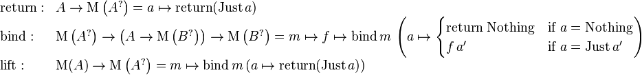
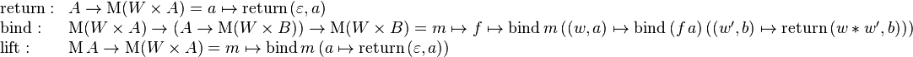
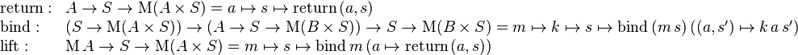

# Types API 

Here is a list of all monad transformers and the methods that they add to the wrapper object. 

## `data.maybe` 

The `maybe` monad transformer automatically checks if your value is undefined and stops the computation if it is. 

### `value.maybeGet(key)` 

A helper to safely retrieve a possibly undefined property of your wrapped value. 

### `value.maybeMap(f)` 

Chains a function that returns a `maybe` value in the computation 

### Definition 

 

### Source 

    
    const idFunc = a => a
    exports.maybe = {
      // Standard functions
      name: 'Maybe',
      // (val) => M({value:val})
      of (val) { return this.outer.of({value: val, something:true }) },
      // (val => M({value:val}) , M({value:val})) => M({value:val})
      chain (funk, mMaybeVal) {
        return this.outer.chain((value) => {
          return value.something ? funk(value.value) : this.outer.of(value) 
        }, mMaybeVal)
      },
      // (M(val)) => M({value:val})
      lift (mVal) {
        return this.outer.chain((val) => this.outer.of({value: val, something: true}), mVal)
      },
      fold (value, maybe) {
          return maybe.something ? value(maybe.value) : (this.onNothing || idFunc )() 
      },
      // Custom functions
      maybeGet (key, val) {
        return val[key] !== undefined ? this.of(val[key]) : this.outer.of({something: false})
      },
      nothing () {
        return this.outer.of({something: false})
      },
      maybeMap (funk, val) {
        const value = funk(val)
        return value !== undefined ? this.of(value) : this.outer.of({something: false})
      }
    }

[_View in GitHub_](../lib/data.js) 

    
## `data.list` 

The `list` monad transformer allows you to operate on a list of values. instead of on a single value. 

### `List.fromArray(val)` 

Wraps an array in a list monad transformer instance. 

### `values.filter(fn)` 

Filters out the values that don't match the predicate. Same as `Array.prototype.filter`. 

_The behaviour of `Array.prototype.map` is covered by the monad transformer `map` method._ 

### Source 

    
    exports.list = {
      name: 'List',
      // Standard functions
      // (val) => M([val])
      of (val) {
        return this.outer.of([val])
      },
      // (val => M([val]) , M([val]))=> M([val])
      chain (funk, mListVal) {
        return this.outer.chain(listVal => {
          return listVal.length === 0 ? this.outer.of([]) : listVal
            .map(funk)
            .reduce((accumulatedVal, newVal) => {
              return this.outer.chain(accumulated => {
                return this.outer.chain(_new => 
                  this.outer.of(accumulated.concat(_new)), newVal)
            }, accumulatedVal)
          })
        }, mListVal)
      },
      // (M(val)) => M([val])
      lift (val) {
        return this.outer.chain(innerValue => this.outer.of([innerValue]), val)
      },
      // ((val) => otherVal, M([val])) => otherVal
      value (funk, val) {
        return this.outer.value((list) => {
          return list.map(funk)
        }, val)
      },
      fold (value, list) {
        return list.map(value)
      },
      // Custom functions
      filter (funk, val) {
        if (funk(val)) {
          return this.of(val)
        } else {
          return this.outer.of([])
        }
      },
      fromArray (val) {
        if (val.concat && val.map && val.reduce && val.slice) {
          return this.outer.of(val)
        } else {
          throw val + ' is not a list.'
        }
      }
    }

[_View in GitHub_](../lib/data.js) 

    
## `data.writer` 

The writer monad transformer augments the wrapped value with one additional value which may be used for storing some additional information about the computation. 

The additional value must be an object that has a `concat` method (as String or Array). 

### `value.tell(val)` 

Concats `val` to the current log value. 

### `value.tellMap(f)` 

Calls `f` with the current value as an argument and then concats the result to the current log value. 

### Definition 

 

###Source 

    
    const concatLog = (log, newLog) => {
      if(log === undefined) {
        return newLog
      } else {
        if (newLog === undefined) {
          return log
        } else {
          return log.concat(newLog)
        }
      }
    }
    
    exports.writer = {
      name: 'Writer',
      // Standard functions
      // (val) => M([val, log])
      of (val) {
        return this.outer.of({value: val, writer: undefined})
      },
    
      // (val => M([val, log]), M([val, log])) => M([val, log])
      chain (funk, mWriterVal) {
        return this.outer.chain((writerVal) => {
          const val = writerVal.value, log = writerVal.writer
          const newMWriterVal = funk(val)
          return this.outer.chain((newWriterVal) => {
            const newVal = newWriterVal.value, newLog = newWriterVal.writer
            return this.outer.of({value: newVal, writer: concatLog(log, newLog)})
          }, newMWriterVal)
        }, mWriterVal)
    
      },
      // (M(val) => M([val, log])
      lift (mVal) {
        return this.outer.chain((val) => this.outer.of({value: val, writer: undefined}), mVal)
      },
      // ((val) => b, M([val, log])) => b
      fold (value, writerVal) {
        (this.onWriterLog || idFunc)(writerVal.writer)
        return value(writerVal.value)
      },
      // Custom functions
      tell (message, val) {
        return this.outer.of({value: val, writer:message})
      },
      tellMap (fn, val) {
        return this.outer.of({value: val, writer: fn(val)})
      }
    }

[_View in GitHub_](../lib/data.js) 

    

## `comp.state` 

The `state` monad transformer allows you to keep one additional mutable state value with your computation. 

### `value.save()` 

Saves the return value of the function in the state, overwriting the previous one. 

### `value.load()` 

Returns the current state. 

### `value.statefulMap(f)` 

Maps over the current value and state with `f`. The function should return an array containing two elements - the new value and the new state. 

### Definition 

 

###Source 

    const idFunc = a=>a
    
    exports.state = {
      name: 'State',
      //Standard functions:
      of (val) {
        return (prevState) => this.outer.of({value: val, state: prevState})
      },
      chain (funk, state) {
        return (prevState) =>
          this.outer.chain((params) => {
            const newVal = params.value, newState = params.state
            return funk(newVal)(newState)
          }, state(prevState))
      },
      lift (val) {
        return (prevState) =>
          this.outer.chain((innerValue) => this.outer.of({value: innerValue, state: prevState}), val)
      },
      run (f, state) {
        return f(state())
      },
      fold (value, params) {
        (this.onState || idFunc)(params.state)
        return value(params.value)
      },
      //Custom functions:
      loadState (val) {
        return (prevState) => this.outer.of({value: prevState, state: prevState})
      },
      saveState (val) {
        return (prevState) => this.outer.of({value:val, state: val})
      },
      statefulMap (funk, val) {
        return (prevState) => {
          const stateTuple = funk(val, prevState)
          return this.outer.of({value: stateTuple[0], state: stateTuple[1]})
        }
      },
      setState (newState, val) {
        return (prevState) => this.outer.of({value:val, state: newState})
      },
      mapState (funk, val) {
        return (prevState) => this.outer.of({value:val, state: funk(prevState, val)})
      }
    }
    
## `comp.reader` 

The `reader` monad transformer allows you to specify an immutable configuration for your function which you can use to tweek the way it behaves. 

### Definition 

 

###Source 

    exports.reader = {
      name: 'Reader',
      //Standard functions:
      of (val) {
        return (env) => this.outer.of(val)
      },
      chain (funk, reader) {
        return (env) =>
          this.outer.chain((val) => {
            return funk(val)(env)
          }, reader(env))
      },
      lift (val) {
        return (env) => val
      },
      run (f, reader) {
        return f(reader(this.environment))
      },
      fold (value, val) {
        return value(val)
      },
      //Custom functions:
      readerMap (f, val) {
        return (environment) => this.outer.of(f(val, environment))
      },
      loadEnvironment(val) {
        return (environment) => this.outer.of(environment)
      }
    }

[_View in GitHub_](../lib/comp.js) 

    
## References 

All images, taken from [the Wikipedia article on monad transformers](https://en.wikipedia.org/wiki/Monad_transformer). 

    
