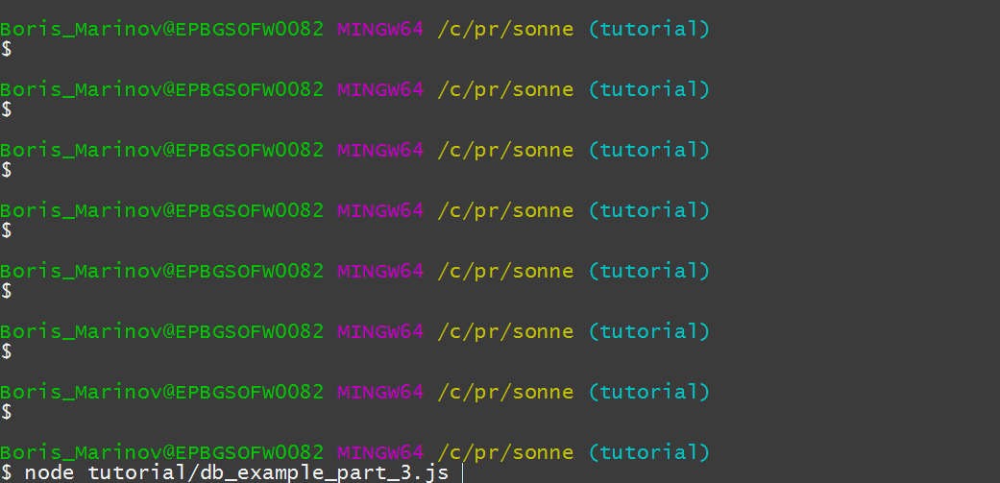
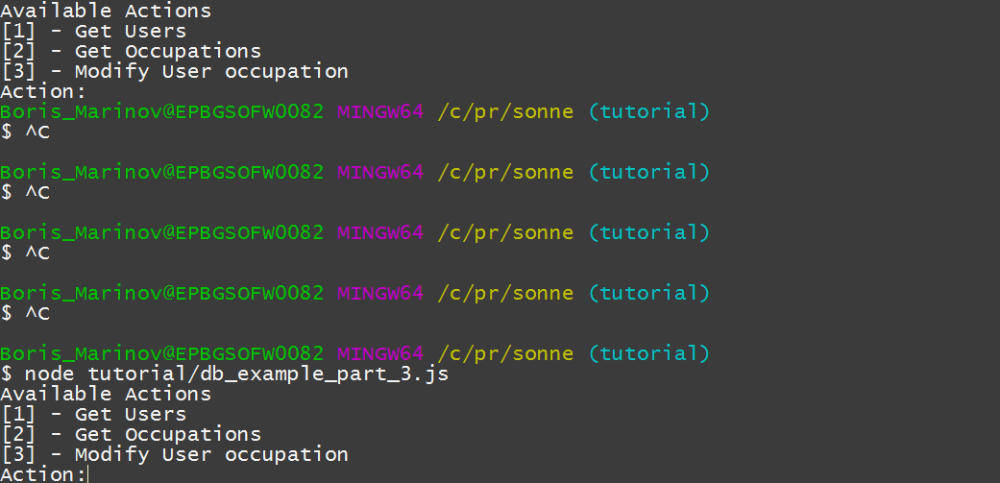

# Side effects 

_This is part 3 from the `monad-transformers` tutorial. See also [part 1](p1.md) and [part 2](p2.md)._ 

> Creating and using custom monads. 

The monadic functions that we used so far were really cool and all, but they were just functions, albeit asynchronous. They only received input at the beginning and did not place any output until the end. Technically they were not pure (because they accessed and modified external resources), but they were pretty close. Now we are going to do something different - we are going to handle interactive IO.  

    
    const assign = require('object-assign')
    const mtl = require("../lib/main.js")
    process.stdin.setEncoding('utf8');
    const util = require('util');
    if ( global.v8debug ) {
    	global.v8debug.Debug.setBreakOnException()
    }
    
Now in the previous example we handled side effects using the `Reader` monad and  aside from the fact that we were abusing it (the environment in `Reader` is supposed to be immutable, and ours was mutable). This approach wasn't bad at all - when calling the function we could specify what part of the environment it was permitted to  touch. From inside the function we could regulate which parts of the code had access to  the environment - for example functions we call using `map` cannot touch it (unless we loaded it  beforehand using `loadEnvironment`). 

When doing IO we also have an environment on which we act on (in this example it is the `process` object in nodeJS) so it make sense to use something as `Reader` as a base. Only this time we are going to modify it  just a little bit, so it fits our needs exactly. 

## Defining a IO monad transformer 

Monads are used for handling IO in the following way:  

1. An IO monad is defined which holds an external environment within itself. 

2. Users use the monad to compose pure functions which generate a side effect. 

3. The effects are executed. 

That is what we are going to do here now. 

The first part is to define a monad transformer for handling IO. We are going to start with the original implementation of the `Reader` monad transformer which is the following: 

    
    const reader = {
      name: 'Reader',
      //Standard functions:
      of (val) {
        return (env) => this.outer.of(val)
      },
      chain (funk, reader) {
        return (env) =>
          this.outer.chain((val) => {
            return funk(val)(env)
          }, reader(env))
      },
      lift (val) {
        return (env) => val
      },
      run (f, reader) {
        return f(reader(this.environment))
      },
      fold (value, val) {
        return value(val)
      },
      //Custom functions:
      readerMap (f, val) {
        return (environment) => this.outer.of(f(val, environment))
      },
      loadEnvironment(val) {
        return (environment) => this.outer.of(environment)
      }
    }
    

The core of the definition are a bunch of [standard functions](../implementing-transformer.md) which define how to "wrap" a plain normal values in a `Reader` function (`of` and `lift`), how to `run` an already-created `Reader`, against a specific environment and most importantly,  how to apply a function which takes a normal plain value and returns an instance of `Reader` to an already-created `Reader`(the infamous `chain`). However most of the works is done via custom functions (helpers if you will). The helpers are the interface of our monad. 

Let's see how far can we go with our custom monad by keeping the standard functionality as-is  and only redefine the helpers, so they are more IO-friendly. 

So let's begin by copying the `Reader` monad: 

    var io = reader

Change the name, so we don't confuse the two monads while debugging: 

    io.name = 'IO'

And lastly, we are also going to patch the `run` method so our new monad uses the `process` global variable as its environment (while leaving the possibility to mock our `process` object if we want to). 

    io.run = function run (f, reader) {
      return f(reader(this.process || global.process))
    }

Our IO monad transformer is now valid and it can be used.  All we have to do is define some helpers that will make it more usable in its new context. 

The standars `Reader` helpers provide direct access to the environment to the functions we compose. Which is OK if the environment is immutable so our users can see it but cannot touch it but not OK in the current case. Now we prefer to keep our side effects inside the monad's implementation - that is the purely-functional contract. 

So let's just remove the original helpers and start from scratch: 

    delete io.readerMap
    delete io.loadEnvironment

If we wanted to keep them, we would have to change their names so our  new monad can be used  along with the original `Reader`. 

Now let's start defining our new helpers:  

We will keep it simple defining just one method to write in the standard output and one to read from the standard input. 

The writing part is trivial. From a functional point of view, we just do nothing. All we do is run the side effect: 

    io.write = function (f, val) {
      return (process) => {
        process.stdout.write(f(val)+'\n')//Perform side effect
        return this.outer.of(val)//Return val
      }
    }

The reading part is a bit harder because the input is asynchronous. So how do we "return" the input if it is not there yet?  One way to do it is to return a continuation instead and then handle this continuation externaly using the task monad.  

It will look like this: 

    const unescapeString = (str) => {
      const str2 = '"' + str.slice(0,-1).slice(1) +'"'
      return JSON.parse(str2).trim()
    }
    
    io.promptFor = function (f,val) {
      return (process) => {
        process.stdout.write(f(val)) //prompt the user to write a value
        return this.outer.of((error, success) => {//Return a continuation, resolved with the user input
          const processData = (text) => {
            process.stdin.removeListener('data', processData)
            process.stdin.pause()
            const input = util.inspect(text)
            success(unescapeString(input))
          }
          process.stdin.resume()
          process.stdin.on('data',processData)
        })
      }
    }

And it can be used like this: 

    const ioM = mtl.make(mtl.base.task, io)
    
    const getUsername = () =>
      ioM.of()
        .promptFor(()=> 'Username: ')
        .chain((usernameContinuation) => m.fromContinuation(usernameContinuation))
        .write((username) => `Your username is "${username}"`)
    

By now you probably know that although the second step is redundant it  has to be there in order for our transformations to act independently of one another, and to be usable by themselves. 

What you may not know is that they don't _have_ to be independent. 

Sure, defining the transformers separately from one another gives us much freedom in composing them but sometimes we may want to define a transformer for a specific use case and on a  specific stack. If that is what we want, we can freely make use of the other monads that we have there: 

###Interlude: Dependencies between monad transformers. Reusing functions in across different stacks 

When several monad transformers are chained, their transformations are  applied sequentially. This means that each transformation has access to  and can trigger all previous (or "outer") transformations. 

Monads are specified in the `make` method from left to right. This means that if we have a stack composed of `mtl.base.task` and then `io` then we can use the `Task` monad transformer in the implementation of the `io` monad transformer. 

Let's try it. for example by redefining the `promptFor` method so it creates a Task directly (all we have to do is change the `of` method to `fromContinuation`): 

    io.promptFor = function (f,val) {
      return (process) => {
        process.stdout.write(f(val))
        return this.outer.fromContinuation((error, success) => {
          const processData = (text) => {
            process.stdin.removeListener('data', processData)
            process.stdin.pause()
            const input = util.inspect(text)
            success(unescapeString(input))
          }
          process.stdin.resume()
          process.stdin.on('data',processData)
        })
      }
    }

When we define the stack we have to make sure that there is a Task monad transformer to the left of the monad that uses it: 

    
    const ioMNew = mtl.make(mtl.base.task, io)
    

Then we can use the function just the way that we wanted to use it: 

    const getUsernameNew = () =>
      ioMnew.of()
        .promptFor(()=> 'Username: ')
        .write((username) => `Your username is "${username}"`)
    

Because we keep the side effects strictly inside the monad we still can chain the IO-bound functions in the same way as pure ones. Here is a more complex example requesting a username and a password and then displaying them both: 

    const getUsernamePass = () =>
      ioMNew.of()
        .promptFor(()=> 'Username: ')
        .write((username) => `Your username is "${username}"`)
        .chain((username) => 
            ioMNew.of(username)
              .promptFor((username)=> `Password for "${username}": `)
              .write((password) => `Attempting connection for ${username}:${password}`))
    
    //getUsernamePass().run()
    

 

You may already recognize this pattern - using a custom lambda to bind two or more values to constants so we can use it for creating a third value (which in this case it is an IO action). 

What is cool when building dependencies as monad transformers is that each new transformation "inherits"  the methods of the previous transformations, which means that the `IO` transformation will work on any arbitrary stack, as long as it includes the `Task` transformation, no matter how many other transformations there are. 

Let's for example define a stack which contains the transformers that we used in the previous examples: 

    
    const m = mtl.make(mtl.base.task, mtl.data.maybe, mtl.data.writer, mtl.comp.reader, io)
    

This would allow us to run all functions that we defined early on - remember that we parametrized the `m` argument, so they don't rely on explicit stack.  

Let's import them: 

    
    const previous = require('./db_example_part_2.js')
    const initData = previous.initData
    const mGetResourceFrom = previous.mGetResourceFrom
    const mPostResourceTo = previous.mPostResourceTo
    

## Our first "real" application 

We are doing a command-line interface for retrieving and modifying our resources using the IO monad that we just defined and the functions for retrieving and modifying resources from the previous chapter. 

As usual we will start by creating some general definitions and will gradually move to more specific use cases. 

### Displaying resources 

To display a resource, we must retrieve it and then write it in the screen: 

    
    prettyPrint = (obj) => JSON.stringify(obj, null, 4)
    
    const displayResource = (type) => (id) => 
      mGetResourceFrom(type, id, m)
        .write(()=> `Displaying info for "${id}"`)
        .write(prettyPrint) 
    

Normally in an application before requesting a resource we have to prompt the user for its ID. Here is a general function for prompting for resource: 

    
    const promptForResource = (type) => 
      m.of(type).promptFor((type)=> `${type} ID:`)

As you can probably guess. These two steps can be composed seamlessly: 

    const promptAndDisplayResource = (type) =>
      promptForResource(type).chain(displayResource(type))
    

### Modifying resources 

How do we modify a resource from our command-line app? 

The function looks a bit convoluted, because there are a lot of values involved, but it can be achieved just by combining the steps that we defined so far. 

The following function propts for a resource, and then allows you to modify one of the resource's properties: 

    const set = mtl.curry((obj, key, value) => {
      const newObj = assign({}, obj)
      newObj[key] = value
      return newObj
    })
    
    const modifyResourceProperty = (type, property) => promptForResource(type).chain((id) => 
        //Retrieve the resource
        mGetResourceFrom(type, id, m) 
          .chain((userInfo) => m.of(userInfo) 
            //Prompt for a new property value
            .promptFor((userInfo) => `${userInfo.name} is currently ${userInfo.occupation}. Choose another occupation:`)
            //Modify the resource
            .map(set(userInfo, property))
            //Post the new version
            .chain(mPostResourceTo(type, id))))
    

### Putting it together 

We are now going to create a menu for our console application. We can do that by putting some actions in an object and then `prompt` users for the action that they want to undergo. We are going to solve the problem of our program quitting by calling our `main` function recursively. 

    
    const start = () =>
      promptForAction(Object.keys(actions))
        .chain((name) => actions[name])
    
    const actions = {
      'Get Users': promptAndDisplayResource('users').chain(start),
      'Get Occupations': promptAndDisplayResource('occupations').chain(start),
      'Modify User occupation': modifyResourceProperty('users', 'occupation').chain(start)
    }
    
    const promptForAction = (actions) => 
      m.of(actions)
        .write(()=> 'Available Actions')
        .write((items)=> items.map((item, i) => ( `[${i + 1}] - ${item}`)).join('\n'))
        .promptFor(()=> 'Action:')
        .chain((index)=> m.of(actions).maybeGet(parseInt(index - 1)))
    

### Running the program 

We are going to run the program against a fresh environment. In case of something bad happens we will just print the error: 

    
    //start().run(result => console.log(result), {environment:initData()})
    

 

    
